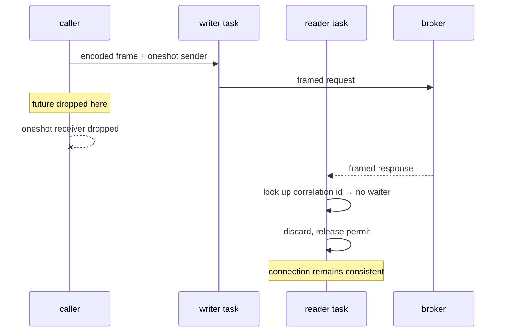

# Cancel safety

> **Every public async fn must be cancel-safe.** Dropping the future releases
> buffers and either completes-and-discards the in-flight request or closes
> the connection. Never leave a connection with a half-read response.

## Why this rule exists here specifically

A UI backend cancels futures constantly, and not because of anything
exceptional:

- A user closes a tab mid-scan.
- An HTTP request times out while three admin RPCs are in flight.
- `tokio::select!` races a fetch against a shutdown signal.
- A `Stream` is dropped after the caller has seen enough records.

If any of those can leave a connection with a partially-consumed response
frame, then the *next* request on that connection decodes the tail of the
previous one. The symptom is a decode error on an unrelated call, minutes
later, on a different topic — a bug that is very hard to trace back to the
tab that was closed.

## How the connection makes it structural

The property is not maintained by careful cleanup code. It falls out of the
[connection actor's](connection.md) shape: **the caller never touches the
socket.**

Drop the future and the `oneshot` receiver goes away. The request is still
written; the response is still read in full; the reader finds no waiter and
discards it. The in-flight permit is released by its guard rather than by an
explicit path that a `?` could skip.

**The only cost is one wasted round trip.** There is no state to unwind,
because there was never any caller-owned socket state to begin with.

## What this means for the layers above

Because `kafka-conn` is cancel-safe by construction, the layers above inherit
it for free as long as they hold one rule: **do not hold a resource across an
await that a drop would need to clean up.**

In practice:

- **`kafka-meta`** — the pool's per-endpoint connect mutex is held across the
  handshake. Dropping there releases the mutex and leaves no half-open
  connection, because the connection is only published to the pool once fully
  established.
- **`kafka-admin`** — every method is a send-and-convert. Dropping mid-call
  discards a response.
- **`kafka-read`** — the interesting one. A scan holds a decode buffer and
  in-flight fetches. Dropping the stream drops the buffer and the fetch
  futures, each of which is individually cancel-safe. Nothing is left behind
  and no connection is disturbed.

## Cancel-safe is not the same as atomic

Worth stating plainly, because the rule is easy to over-read.

Dropping the future for a mutating call does **not** cancel the operation on
the broker. `create_topics` whose future is dropped after the request was
written will very likely still create the topic — the request was sent, and
Kafka has no cancellation. What the rule guarantees is that the *connection*
stays usable, not that the *cluster* is unchanged.

For a read-heavy UI this distinction rarely bites. It matters for anything
mutating, where "the future was dropped" must not be read as "it did not
happen".

## Verification

The leak test spawns 1,000 scans, cancels them at random points, and asserts
that connection count and RSS both return to baseline. A cancel path that
leaked a connection, a permit or a buffer would show up as drift in one of
those two numbers rather than as a test that fails cleanly, which is why the
assertion is on the process rather than on a return value.
