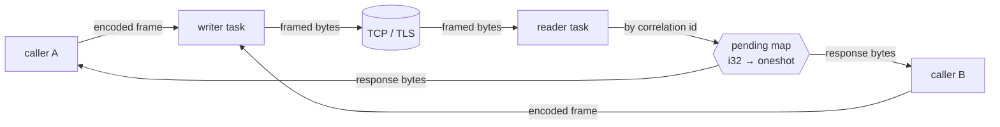

# The connection actor

One socket, two tasks, one correlation map. `Connection` is the whole of
`kafka-conn`'s runtime surface: hand it a request, get a response, with many
requests in flight at once.

## Decoding happens on the calling task

The reader task does exactly one thing with a response frame: look up its
correlation id and hand the raw `Bytes` to whoever is waiting. It does not
decode.

That placement is deliberate. If the reader decoded, a single response that
failed to parse — a version negotiated wrongly, a schema that drifted — would
be an error *in the reader task*, and the reader task is shared by every
request on that connection. Decoding on the calling task means a malformed
`DescribeConfigs` response fails `describe_configs` and nothing else.

## Framing

A 4-byte big-endian length prefix, then header and body. That is
`LengthDelimitedCodec`'s default configuration, and
`crates/kafka-conn/src/codec.rs` states it explicitly anyway so that a future
edit cannot quietly change endianness.

Frames are capped at `DEFAULT_MAX_FRAME_BYTES` — 100 MiB, matching Kafka's
own `socket.request.max.bytes` default. A frame larger than that is a
protocol desync rather than a big fetch, and reading it would be an unbounded
allocation driven by the peer.

## Two header traps

Both produce an off-by-a-few-bytes failure rather than a clear error, which
is what makes them expensive:

**The response header version is not the request's api version.** It is a
per-api, per-version mapping. The code asks `ApiKey::response_header_version`
rather than deriving it, because deriving it is how you end up two bytes into
the body wondering why a string length is nonsense.

**`ApiVersions` responses always use response header v0**, even once the
connection is flexible. This is a real special case in the protocol — a
chicken-and-egg escape hatch, because the client does not yet know what the
broker speaks when it sends the first request. Get it wrong and your very
first round trip fails. `kafka-protocol` encodes this in
`ApiVersionsResponse::header_version`, which is another reason to go through
the helper rather than compute it.

## Pipelining

`max_in_flight` defaults to 5, matching Kafka's own default. The broker
processes one connection's requests in order regardless, so this is about
pipelining rather than parallelism — raising it trades head-of-line blocking
for memory.

A permit is acquired before writing and released by a guard, so a dropped
future cannot leak one. `with_max_in_flight(0)` is clamped to 1: zero permits
is a deadlock, not a configuration, and there is a unit test asserting it.

> **This default becomes load-bearing the moment a producer exists.** Five
> requests in flight is only safe with idempotence enabled; without it, a
> retried produce batch can land after a later one and silently reorder the
> log. Nothing in the workspace retries a write today, so it is currently
> harmless — see [Roadmap](../guide/roadmap.md), where wiring this to the
> idempotence setting is called out as a milestone requirement.

## Cancel safety

Rule 5: dropping a `send` future must never leave the socket half-read. It
cannot here, and the reason is structural rather than careful — **the caller
never touches the socket**.

Drop the future and the `oneshot` receiver goes away. The request is still
written by the writer task, the response is still read by the reader task,
and the reader discards it on finding no waiter. The in-flight permit is
released by its guard. The connection stays perfectly consistent; the only
cost is one wasted round trip.

[Cancel safety](cancel-safety.md) covers what this means for the layers
above.

## Death

When the socket dies, every pending caller resolves to
`Error::ConnectionClosed` and every subsequent send fails immediately.

The alternative — futures that hang — is much worse than it sounds for this
library's use case. A UI backend that leaks one hung future per dead broker
degrades into a process that appears to be working while doing nothing, and
the symptom shows up far from the cause.

## Bootstrapping ApiVersions

The first request on a connection is a bootstrapping problem: you cannot know
the broker's supported range until you have asked, and asking requires
picking a version.

The connection sends at our max and treats error code 35
`UNSUPPORTED_VERSION` as data rather than as a handshake failure — **the
broker still returns its version table in that error response**, so the
correct reaction is to read it and retry at v0. Treating it as fatal is a
client that cannot talk to any broker older than itself.

See [Version negotiation](version-negotiation.md) for what happens with that
table afterwards.

## Per-connection counters

Every connection tracks bytes and requests sent and received
(`crates/kafka-conn/src/stats.rs`). These exist from the beginning rather
than being added when something needed them, because two acceptance criteria
depend on them: the backward-scan test asserts that reading the last 500
records of a 100k-record partition fetches less than 5% of the partition, and
that assertion is unverifiable without a byte counter.
