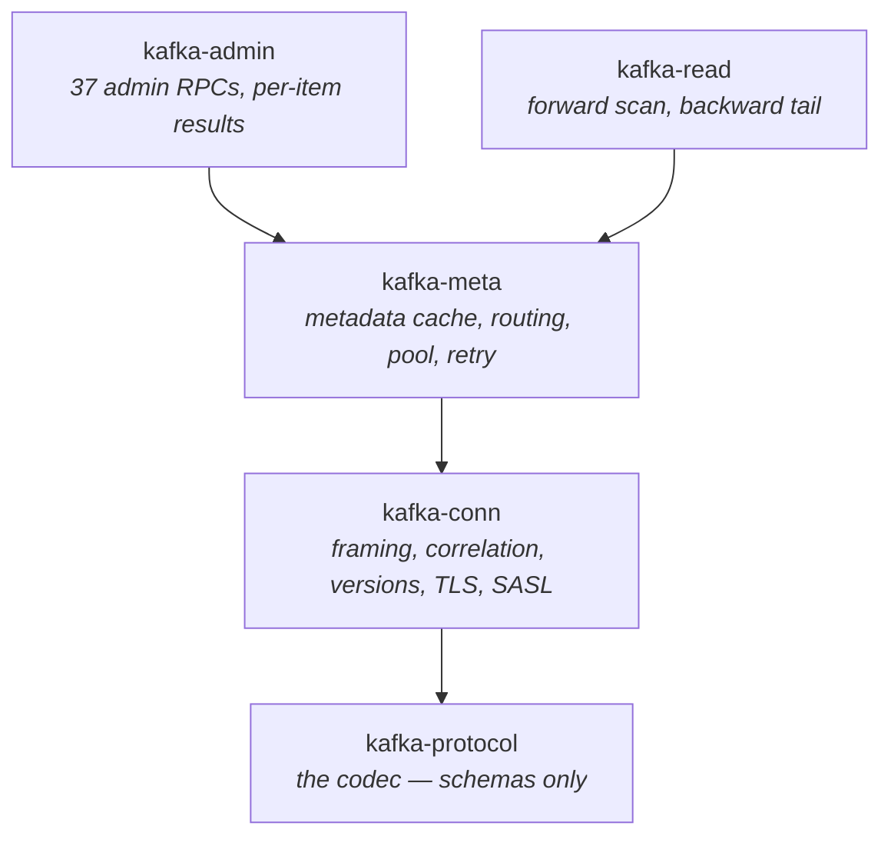
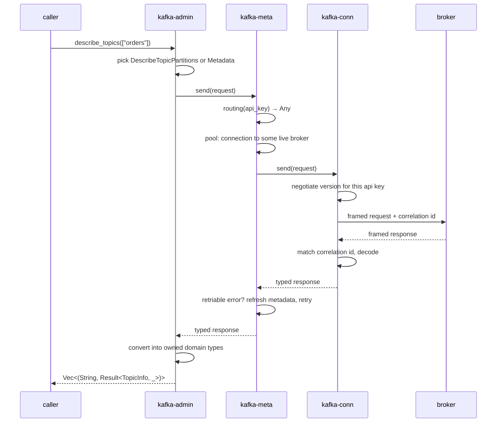

# System overview

Five crates in a strict stack. Each depends only on the ones below it, and
each converts the layer below's vocabulary into its own before exposing
anything. There are no cycles and no sideways dependencies — `kafka-admin`
and `kafka-read` do not know about each other.

## What each layer decides

**[`kafka-conn`](../code-tour/kafka-conn.md) owns one socket.** Length-prefixed
framing, a correlation map so many requests can be in flight at once,
[version negotiation](version-negotiation.md) per api key,
[TLS and SASL](security.md), and the
[read-only gate](read-only-gate.md). It knows nothing about clusters — give
it an address and it gives you request/response against that one broker. It
also owns the two protocol *vocabularies*, `ApiKey` and `ErrorCode`, because
every layer above needs to name them and a workspace with two of each would
push conversions into every call site.

**[`kafka-meta`](../code-tour/kafka-meta.md) owns the cluster.** Which brokers
exist, which one leads each partition, which one coordinates each group, and
which of them a given request is even allowed to go to. It holds the
connection pool and the retry policy, so a caller above sends through
`Cluster` and gets routing, reconnection and stale-metadata retries for free.
Its two tables — [routing](metadata-routing.md) and
[errors](errors.md) — are first-class artifacts in their own files.

**[`kafka-admin`](../code-tour/kafka-admin.md) and
[`kafka-read`](../code-tour/kafka-read.md) own the domain.** Both are pure
translation: build a request from owned types, send it through `Cluster`,
convert the response back into owned types. Neither opens a socket or picks a
broker.

## The one deliberate exception

`Connection::send` is generic over `kafka_protocol::protocol::Request`. This
is the only place an upstream type appears in a public signature anywhere in
the workspace, and it is deliberate: `kafka-conn` *is* the wire boundary, and
a parallel request trait defined here would convert protocol types into
protocol types for no gain.

Everything above it is held to the rule without exception. See
[The domain boundary](domain-boundary.md).

## How a request actually travels

Take `admin.describe_topics(["orders"])`:

Three decisions on that path are worth naming because each has its own
chapter:

1. **Which api version** — never hardcoded, always the overlap of what the
   broker advertises and what this build can encode
   ([Version negotiation](version-negotiation.md)).
2. **Which broker** — four routing classes, and sending to the wrong one
   produces a retry loop that looks like a flaky cluster rather than an error
   ([Metadata, routing and the pool](metadata-routing.md)).
3. **Whether the answer is retriable** — classified along three independent
   axes, in one table ([The error taxonomy](errors.md)).

## Where the read path differs

`kafka-read` sends `Fetch` to a partition leader and then does something the
admin path never does: it decodes record batches. That is the only place in
the workspace where bytes from an untrusted producer are parsed, and it is
why two chapters exist that have no admin equivalent —
[the read path](read-path.md) for the scan shapes, and
[tolerant decoding](tolerant-decoding.md) for what happens when those bytes
are wrong.

## What is not here

The producer, group membership and fetch sessions that this section once
listed as absent have all landed — they live in `kafka-produce` and
`kafka-consume`. What remains true is narrower: **`kafka-read`'s scan API is
one-shot by design and maintains no incremental fetch state**, because a
browse is not a subscription. `kafka-consume` is the crate that keeps a
session.

See [Non-goals](../compat/non-goals.md) for the decisions that are still
decisions, and [Roadmap](../guide/roadmap.md) for what shipped.
