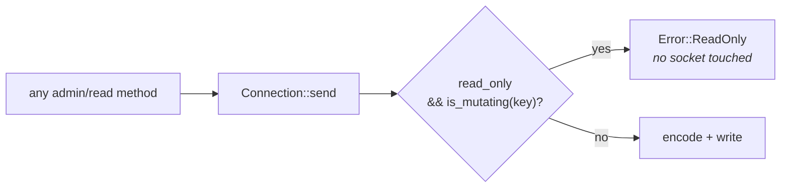

# The read-only gate

A client constructed read-only returns `Error::ReadOnly` for every mutating
RPC **before touching the network**.

```rust,no_run
use kafka_admin::{Admin, ClusterConfig};

# async fn example() -> kafka_admin::Result<()> {
let admin = Admin::connect_read_only(["localhost:9092"], ClusterConfig::default()).await?;
# Ok(())
# }
```

Under the hood this is one flag on `ConnectionConfig`, which also means you
can build it yourself with `ConnectionConfig::new().read_only()` and hand it
to any layer.

## Enforced on the api key, not the method surface

This is the whole design, and it is the difference between a property and a
convention.

The gate lives in `Connection::send` and matches on `ApiKey` —
`ApiKey::is_mutating`. It does **not** live on `kafka-admin`'s method
surface.

The consequence: an admin method added tomorrow is covered without anyone
remembering to cover it. `ApiKey` matches the protocol's closed set, so a new
method necessarily sends an existing api key, and there is no way to reach
the socket without passing the check. Enforcing on our own method surface
would make the property depend on every future contributor remembering an
annotation.



## The wildcard arm is `true`

`is_mutating` is written as an **allowlist of read-only keys** with a
`_ => true` fallback. The direction is the entire security property.

```rust,no_run
# enum ApiKey { Fetch, Metadata }
# const fn example(key: ApiKey) -> bool {
match key {
    ApiKey::Fetch | ApiKey::Metadata /* … 26 more … */ => false,
    // Deny by default. Do not replace this with `_ => false`.
    _ => true,
}
# }
```

`ApiKey` is `#[non_exhaustive]` and carries an `Unknown(i16)` variant, so the
wildcard is mandatory. Making it `false` would silently un-gate every API
added by a future Kafka release and every key we have never heard of — which,
given that [the codec is a release behind the broker](version-negotiation.md),
is not a hypothetical set.

Note that this is the **opposite** default from
[the routing table's](metadata-routing.md) wildcard, which is `Routing::Any`.
Mis-routing costs a redirect; mis-classifying a mutating API costs the
property. Each wildcard is chosen for its own failure cost.

## Two entries that look wrong

**`FindCoordinator` is classified read-only** even though on some clusters it
can trigger creation of the internal `__consumer_offsets` topic. A read-only
client cannot fetch a committed offset without it, and the alternative —
parsing `__consumer_offsets` ourselves — is
[explicitly forbidden](../compat/non-goals.md). This is a considered trade,
not an oversight.

**`SaslHandshake` and `SaslAuthenticate` are classified read-only.** They
mutate connection state rather than cluster state, and gating them would make
a read-only client unable to authenticate, which is to say unable to read.

## Non-obvious mutators

Several keys that read like queries are classified mutating, correctly:

- `OffsetCommit`, `OffsetDelete` — they write group state
- `InitProducerId`, `AddPartitionsToTxn` — they allocate and fence producer
  state
- `Produce` — obviously. It was classified and gated before anything in the
  workspace could send one, which is the point of gating on `ApiKey` rather
  than over a method surface: `kafka-produce` arrived already covered, and its
  acceptance suite asserts a read-only client refuses to produce without the
  gate having heard of the crate

## What it does and does not protect

**It does** stop a UI backend from mutating a cluster its operator would
rather nobody mutated, including through a bug or an unintended code path,
and it does so without a round trip.

**It does not** replace broker-side authorization. It is a client-side
safety catch, enforced in a process the operator may not control. A cluster
that must not be mutated by a principal should say so with ACLs; this gate
protects against the UI doing something nobody asked it to, not against a
hostile client.

**And it classifies api keys, not request contents.** `Metadata` is
read-only, yet a developer hand-building a `MetadataRequest` with
`allow_auto_topic_creation(true)` and sending it through the generic
`Cluster::send_any` escape hatch can create a topic on a permissive cluster
while passing the gate. The library's own metadata layer always sends
`false`; the boundary is the request *type*, and a caller constructing raw
`kafka_protocol` structs is deliberately past it.

## Verification

The acceptance test drives its assertion from `ApiKey::iter` rather than from
a hand-written list, so every key the protocol defines is checked and new
protocol keys are covered automatically as the codec learns them. That is the
same reasoning as the wildcard arm, applied to the test.
