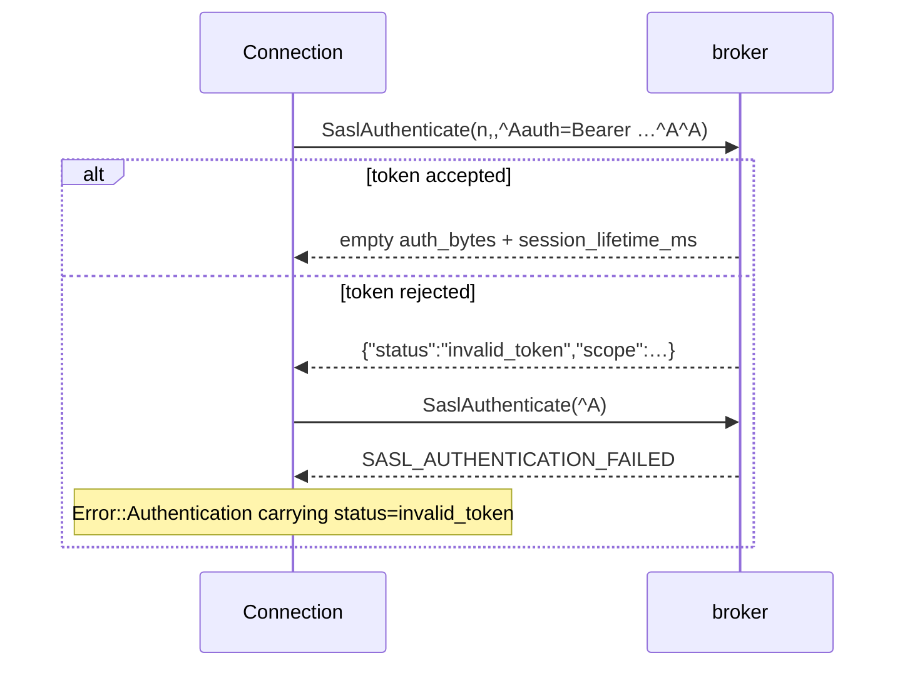

# TLS, SASL and re-authentication

## TLS

`tokio-rustls` with the **`ring`** provider rather than the default
`aws_lc_rs`. That is a build-time decision, not a cryptographic one:
`aws-lc-sys` needs cmake and a C toolchain, `ring` builds with `cc` alone,
and CI on a minimal runner image has already lost time to exactly that.

`TlsConfig` covers system roots, a custom CA, client certificates for mTLS,
and an SNI override for the case where the address you dial is not the name
on the certificate — which is routine behind a Kubernetes service or a load
balancer.

## The metadata redirect is a trust decision

A Kafka client does not choose the addresses it connects to after bootstrap:
it follows what metadata responses advertise. Two consequences are worth
having in mind when the brokers themselves are not trusted, and both are
ecosystem-standard rather than specific to this library — the Java client
and librdkafka behave identically.

* **Over TLS with the system trust store**, a hostile broker can advertise
  an endpoint holding a certificate from any *public* CA, and verification
  succeeds. For PLAIN and OAUTHBEARER — which present a reusable credential
  — that endpoint has now harvested it. Per-cluster SASL configuration keeps
  the blast radius to that one cluster; `TrustAnchors::Pem` shrinks it
  further and is the recommended shape for a private-CA cluster: a redirect
  can then only land on an endpoint the cluster's own CA vouched for.
* **Without TLS**, an advertised address steers a plain `TcpStream::connect`
  to any reachable `host:port` — an SSRF-shaped pivot for probing an
  internal network, bounded by the fact that only the Kafka wire protocol is
  spoken to it. This is one more reason "TLS against untrusted brokers" is
  the floor, not a hardening extra.

## Secrets stay in memory until dropped

Passwords, SCRAM-derived keys, bearer tokens, OIDC client secrets and
delegation-token HMACs are held as ordinary `String`/`Vec` values and are
**not zeroized** on drop. This is the Kafka-client norm (librdkafka keeps
credentials in plain heap memory for the connection's lifetime too, for the
same reason: KIP-368 re-authentication needs the credential again hours
later). Zeroization in Rust is also only ever best-effort — every clone,
reallocation and move leaves bytes behind that no `Drop` impl can reach.
The stated position is therefore: memory disclosure of this process is out
of scope for these secrets; deployments for which that is not acceptable
should isolate the process rather than expect the library to scrub RAM.

## SASL mechanisms

`PLAIN`, `SCRAM-SHA-256`, `SCRAM-SHA-512` and `OAUTHBEARER`, negotiated via
`SaslHandshake` followed by `SaslAuthenticate`.

Two of the four put a **directly reusable** credential on the wire: `PLAIN`
sends the password, `OAUTHBEARER` sends a bearer token, and a bearer token is
bearer-grade by definition — whoever reads it can use it until it expires. So
both go through one gate rather than two rules:
`SaslMechanism::sends_reusable_credential` lets the connection layer reason
about the combination of mechanism and transport, and refuses it on a
plaintext socket unless the caller opted in with
`SaslConfig::allow_plaintext_password`. SCRAM sends proofs instead and is not
gated.

## SASLprep is not `trim()`

> A password containing a non-ASCII space authenticates against a Java client
> and fails against ours if this is skipped.

SCRAM hashes the password, so both ends must normalise it *identically*
before hashing. RFC 4013 (SASLprep, a stringprep profile) maps non-ASCII
spaces — U+00A0, the U+2000 block — to U+0020, strips soft hyphens, and
applies a set of prohibited-character and bidirectional rules.

Java clients normalise. A hand-rolled `trim().to_lowercase()` does not, and
the failure mode is a password that works in every test you wrote and fails
for one user whose password manager inserted a non-breaking space. The error
says `authentication failed` and nothing about why.

This is why the `stringprep` crate is a dependency rather than a few lines of
inline character handling.

## The server signature is verified in constant time

SCRAM is mutual authentication: the server's final message carries a
signature that proves it knows the stored key. Verifying it with `==` leaks a
timing oracle on a value an attacker is actively trying to forge, so the
comparison goes through `subtle::ConstantTimeEq`.

Kafka does not do channel binding, so the gs2 header is always `n,,`.

## OAUTHBEARER: the `%x01` separators are the format

> Kafka's own client shipped this wrong, and its broker agreed.

RFC 7628's initial client response is a gs2 header, then `%x01`, then
`%x01`-terminated `key=value` pairs, then one more `%x01` to close the list:

```text
n,,^Aauth=Bearer mF_9.B5f-4.1JqM^A^A
```

Note the two separators at the end. The first ends the `auth` pair, the second
ends the list, and neither is optional.
[KAFKA-7182](https://issues.apache.org/jira/browse/KAFKA-7182) is what getting
this wrong looks like: Kafka emitted the gs2 header without the separators,
its broker accepted it, and the two interoperated with each other and with
nothing else for a year. "It works against my cluster" is therefore not
evidence, which is why the unit tests assert the **exact bytes** rather than a
round trip.

## OAUTHBEARER: a rejected token takes a second round trip

This is the part that gets skipped, and skipping it does not produce a wrong
error — it produces no error at all until the connect deadline.

A good token is one round trip. A **bad** one is two: the broker answers with a
JSON failure challenge and then *waits* for the client to send one more
message, a single `%x01` byte, before it will complete the exchange and fail
it.



The `status` field is the only thing that says *why*: the error code is 58 for
an expired token, an insufficient scope and a wrong issuer alike. It is parsed
out and carried in the message.

Not every broker takes this path. Kafka's own handlers — the unsecured
validator and the built-in OIDC one — use the challenge; `strimzi-kafka-oauth`
fails the exchange immediately with a message instead
(`Signature check failed: Invalid token signature`). Both arrive as
`Error::Authentication`, and both are exercised: the container fixture is the
first, the live Strimzi cluster is the second.

## OAUTHBEARER takes a token *source*, not a token

`SaslConfig::oauth_bearer` takes a `TokenProvider` — any
`Fn() -> impl Future<Output = Result<String>>` is one — and asks it again on
every exchange.

That is not decoration. Re-authentication (below) re-runs the exchange on a
timer this library owns, and an access token captured at construction has
expired by then. A `String` would work in every test and fail hours into
production, which is the same failure shape as skipping KIP-368 altogether.
`SaslConfig::oauth_bearer_token` exists for genuinely short-lived callers — a
CLI run, a one-shot job — and says so.

## Fetching tokens: KIP-768, behind the `oidc` feature

`OidcTokenProvider` implements `TokenProvider` by running
`client_credentials` against a token endpoint, caching the result, and
refreshing at 80% of the token's lifetime — the same fraction the Java client
defaults to — or earlier if the configured margin is tighter.

Three decisions worth stating:

- **It is a cargo feature.** An HTTP client in the crate every other crate
  here sits on is a real addition to a downstream dependency tree, so a caller
  who brings its own tokens does not pay for it. `hyper` + `hyper-rustls` on
  the **`ring`** provider, for the same reason the TLS section gives: anything
  that reaches for rustls's default provider pulls `aws-lc-sys`, which needs
  cmake.
- **No JWT parsing.** The token response carries `expires_in`, so scheduling
  never needs to look inside the token — and it should not. To a *client* an
  access token is opaque; only the broker is entitled to an opinion about its
  claims.
- **A failed refresh is not a failed connection.** The refresh is early by
  design, so when the endpoint is down and the cached token has not expired
  yet, the cached token is presented with a warning. Failing a connection over
  a refresh that was voluntary is worse than using a credential that still
  works.

The failure modes stay distinguishable, which is the point of a separate
`Error::TokenEndpoint` variant:

| What happened | How it surfaces |
|---|---|
| Endpoint unreachable or slow | `TokenEndpoint { status: None, .. }`, retriable |
| Endpoint refused (bad secret, unknown scope) | `TokenEndpoint { status: Some(401), .. }`, not retriable |
| Endpoint fine, broker rejected the token | `Error::Authentication` with the RFC 7628 `status` |

"Your identity provider rejected our client secret" and "the broker rejected
the token it issued" are different problems with different owners. Collapsing
them into one opaque authentication error sends an operator to the wrong
system.

## OAuth over `PLAIN`, and why it is not enough

Worth knowing because it works today and looks like the same thing.

A Strimzi listener configured with `oauth-server-plain` accepts OAuth
credentials *through* the `PLAIN` mechanism, which this library has always
been able to speak: `username` = client id and `password` = client secret has
the broker perform `client_credentials` on the caller's behalf, or `password`
= `$accessToken:<raw token>` has it validate a token directly.

The limitation is the reason `OAUTHBEARER` exists anyway: **`PLAIN` cannot
carry a new token mid-session.** There is no way to hand the broker a
refreshed credential on a live socket, so KIP-368 re-authentication cannot
refresh it and the connection dies when the token expires. The client has to
reconnect, and on a cluster with `connections.max.reauth.ms` set it has to do
so on the broker's schedule.

## KIP-368 re-authentication

**This is the one people skip, and the symptom looks like a network fault.**

`SaslAuthenticate`'s response carries a session lifetime. On any cluster
where `connections.max.reauth.ms` is set — Confluent Cloud sets it — the
broker **kills the connection** when that expires unless the client re-issues
`SaslAuthenticate` on the live socket first.

A UI backend holds connections for hours. Without re-authentication you get
periodic unexplained disconnects, spread across brokers, that read as
flakiness in the network or the cluster and not as an auth problem at all.

The mechanism this needs is slightly awkward, and it is why the SASL exchange
is written against a `SaslTransport` trait rather than directly against a
socket. The same exchange has to run in two very different places:

1. On a **bare framed stream**, during connect, before the connection actor
   has started.
2. On a **live, fully multiplexed connection**, hours later, interleaved with
   other in-flight requests.

Both must behave identically. Abstracting the transport is what makes that
true by construction rather than by keeping two code paths in agreement.

```mermaid
sequenceDiagram
    participant C as Connection
    participant B as broker

    Note over C,B: connect — bare framed stream
    C->>B: ApiVersions
    B-->>C: version table
    C->>B: SaslHandshake(SCRAM-SHA-512)
    B-->>C: ok
    C->>B: SaslAuthenticate(client-first)
    B-->>C: server-first
    C->>B: SaslAuthenticate(client-final)
    B-->>C: server-final + session_lifetime_ms
    Note over C: actor starts; normal traffic flows

    Note over C,B: hours later — live multiplexed connection
    C->>B: SaslAuthenticate(client-first)
    B-->>C: server-first
    C->>B: SaslAuthenticate(client-final)
    B-->>C: server-final + new lifetime
    Note over C: connection survives; callers never notice
```

## The gate lets auth through

`SaslHandshake` and `SaslAuthenticate` are classified **non-mutating** by
[the read-only gate](read-only-gate.md), which looks wrong at first glance
since they plainly change state. They change *connection* state, not cluster
state, and gating them would leave a read-only client unable to authenticate
at all — which is to say, unable to read.

## Verification

The acceptance test boots brokers configured for `SASL_PLAINTEXT`/`PLAIN` and
`SASL_SSL`/`SCRAM-SHA-512`, asserts both authenticate, and asserts a wrong
password yields `Error::Authentication` rather than a timeout. A third case
runs a broker with `connections.max.reauth.ms` set to roughly 10 seconds and
asserts a connection survives past twice that window while still serving
requests — the only way to prove KIP-368 works is to let a session expire.

`OAUTHBEARER` is verified against a broker running Kafka's
`OAuthBearerUnsecuredValidatorCallbackHandler` — a real broker validating a
real exchange, with the *issuer* rather than the broker taken out of the
picture, so no OAuth server is needed to prove the mechanism. `testkit`'s
`unsecured_jws` mints the tokens. Four cases: a valid token authenticates over
`SASL_SSL`; a bearer token on a plaintext socket is refused by default; a
rejected token fails **fast**, with the broker's `status`, rather than hanging
(which is what skipping the `%x01` message looks like); and a connection whose
session expires asks the token source again instead of replaying the token
from connect.

The `oidc` feature adds `tests/oauth_oidc.rs`, split by what it needs. The
token-endpoint half runs in `cargo xtask ci` against a twenty-line local
issuer and no Docker — a refresh schedule that is wrong is wrong without a
cluster — and covers caching, refresh before expiry, single-flight under
concurrency, a 401 naming the endpoint, and an unreachable endpoint staying
retriable. The end-to-end half needs the broker.

None of that reaches a real identity provider, so
`cargo run -p kafka-conn --features oidc --example oauth_live` does: it points
either a caller-supplied token or a live `client_credentials` fetch at an
OAuth-secured cluster. It has been run against Strimzi's
`SASL_SSL`/`OAUTHBEARER` listener with Entra ID as the issuer — RS256 tokens,
JWKS validation, `sub` as the principal — and against a full
`livetest probe` over the same listener, which is what exercises the pool
authenticating every broker connection from one shared token.
