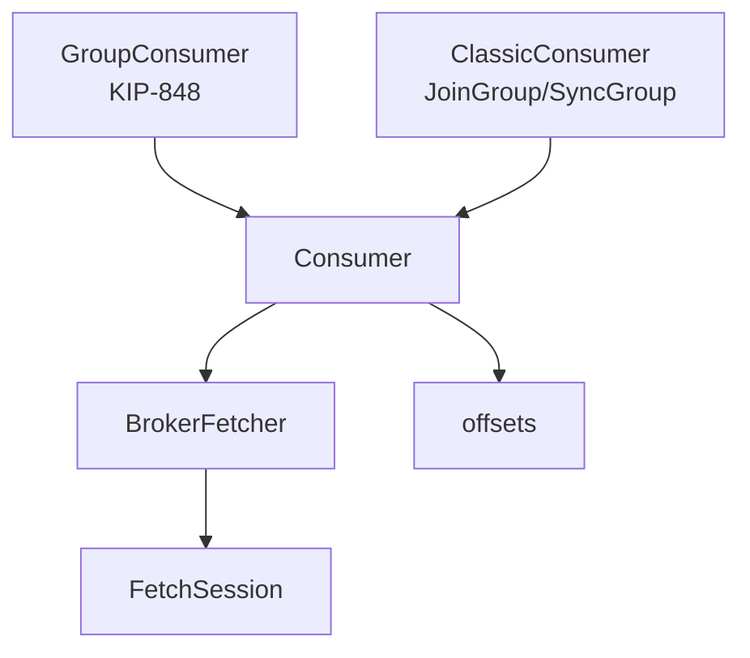

# kafka-consume

The long-running read path: incremental fetch sessions, a fetcher that
batches per broker, and three tiers of membership over one engine. The other
half of lifting the library past its admin-first scope.

**Module map**

| File | Lines | What |
|---|---|---|
| `classic.rs` | 1,512 | the classic protocol, and assignor payloads that must match Java's byte for byte |
| `consumer.rs` | 1,238 | `Consumer`, `GroupConsumer`, `ClassicConsumer` — assignment, `poll`, `seek`/`pause`/`resume` |
| `group.rs` | 514 | KIP-848 membership: one heartbeat RPC and an ordered reconciliation |
| `offsets.rs` | 404 | `OffsetCommit`/`OffsetFetch`, in the member and non-member forms |
| `fetcher.rs` | 304 | one `Fetch` per broker, covering every partition on it |
| `session.rs` | 298 | KIP-227 incremental fetch sessions |
| `rebalance.rs` | 282 | the listener trait, and where a half-done rebalance waits |
| `coordinator.rs` | 74 | re-asking a coordinator that has moved |

## One engine, three ways to decide what it reads

`GroupConsumer` and `ClassicConsumer` both *wrap* `Consumer`. The fetch path,
the sessions, the decoding and the offset plumbing are identical; the only
thing membership changes is where the assignment comes from.

That is why the manually-assigned mode is not a degraded group consumer. It
is the substrate — and it is independently the right answer for pinning a
reader to a partition, which is a thing UIs and single-instance jobs
genuinely want.



## The session epoch rules, which are easy to get subtly wrong

A consumer fetches the same partitions over and over. KIP-227 lets the broker
remember the assignment, so every request after the first sends **only what
changed** — in steady state, nothing at all.

- **`(0, 0)` opens a session.** Not `(0, -1)`: that is the *legacy* sentinel
  meaning "no session at all", and sending it forever is how a consumer
  silently re-sends its whole assignment on every fetch while appearing to
  work perfectly.
- After the broker answers with a session id, every request uses
  `(session_id, epoch + 1)`.
- A partition that leaves the assignment goes into `forgotten_topics_data`
  **once**, on the next request. Leaving it out instead means the broker
  keeps fetching a partition nobody is reading.
- `FETCH_SESSION_ID_NOT_FOUND` and `INVALID_FETCH_SESSION_EPOCH` mean the
  broker dropped the session — a restart, or eviction under cache pressure.
  Both are recovered by opening a new one with the full assignment, and
  neither is ever surfaced to the caller. A broker restart must not kill a
  consumer.

`kafka-read`'s `scan` and `tail` deliberately keep the legacy sentinel. They
are one-shot: a session would make each scan depend on the last and leave
state on the broker for a client that is not coming back.

## The fetch count scales with brokers, not partitions

`kafka-read`'s fetcher takes one topic and one topic id per call, which is
exactly right for scanning one partition and wrong for a consumer. A consumer
holding twelve partitions across two topics on three brokers should send
**three** requests per round, not twenty-four — so `fetcher.rs` groups the
active assignment by leader and asks each broker once.

A broker with nothing assigned still gets one request while it holds a
session, so the forgotten list can drain; only then is the fetcher dropped.

## KIP-848: revoke, then acknowledge

`ConsumerGroupHeartbeat` replaces `JoinGroup`, `SyncGroup` and `Heartbeat`
outright, and the **broker** computes the assignment — which removes the
single largest source of subtle incompatibility in the classic protocol,
because there is no assignor payload to get byte-identical.

What the client still owns is the reconciliation, and it is ordered:

```text
listener.on_revoke  →  auto-commit  →  drop the partitions  →  acknowledge
```

Acknowledging an assignment whose predecessor has not yet been revoked means
two consumers hold the same partition at once — duplicate delivery, with no
error anywhere and nothing in any log to explain it. So a rebalance is **two
beats**: the first learns the target and revokes, the second acknowledges
what is now owned.

The acceptance test asserts **union and intersection**, not record counts. A
reconciliation that acknowledges before revoking still delivers every record;
counting records would pass while the bug is live, and only the empty
intersection catches it.

### The epoch sentinels are not interchangeable

| | Means |
|---|---|
| `0` | join |
| `-1` | leave, releasing the assignment for immediate reassignment |
| `-2` | a **static** member leaving, parking its assignment against `session.timeout.ms` |

Using `-1` for a static member throws away the whole point of
`group.instance.id`: the assignment is handed to somebody else instead of
waiting for the restart.

## A half-done rebalance is state, not a moment

Rule 5 says dropping a `poll` future must be safe, and a rebalance is the
place that is hardest. So a reconciliation that has been computed but not
carried out is held on the consumer (`rebalance::Pending`) rather than run
inline inside the heartbeat: a `poll` dropped mid-callback does not skip it,
because the next `poll` finds it and finishes it, still ahead of the
acknowledging beat.

The cost is that `on_revoke` may run twice for the same partitions, and that
is the tolerable half of the trade — a listener that flushes twice writes the
same bytes twice, while a listener that never fires loses them. It is
documented as at-least-once rather than papered over.

The ordering inside the callback is the other half: the caller flushes
*first* and the offset commit follows, so a committed offset always trails
data the caller has already written. Committing first inverts exactly that,
and the window is as long as the caller's flush.

## The classic protocol's two hard constraints

**The assignor payload has to be byte-identical to Java's.** The group
*leader* computes the assignment, and the leader is whichever member the
coordinator picked — possibly a Java client decoding what we encoded. There
is no negotiation of the format: it is `ConsumerProtocolSubscription` and
`ConsumerProtocolAssignment`, and a field misread produces a group where
somebody's assignment is silently empty. `kafka-protocol` ships both as real
schemas, so none of it is hand-rolled.

**Every member needs its own `Cluster`.** `JoinGroup` blocks on the
coordinator, and a Kafka broker will not read a second request from a socket
until it has answered the first — so two members of one group sharing a
connection deadlock, and it presents as a plain timeout. This is a property
of the protocol rather than of this client, and `GroupConsumer` does not have
it.

### Cooperative rebalancing withholds, and that is the point

Under `range`/`roundrobin` a rebalance is eager: everyone revokes everything
and takes what they are given. Under `cooperative-sticky` (KIP-429) the
leader computes a sticky target and then **withholds** every partition whose
owner is changing — round one assigns it to nobody, the losers revoke and
re-join, and round two hands it over. A partition is never assigned to its
next owner while its previous owner still holds it. Skipping the withholding
step is the bug that delivers every record in a moved partition twice,
silently.

Eager `sticky` is the one assignor deliberately missing: `StickyAssignor`
carries its state in the subscription's `user_data` as a struct with **no
schema in `kafka-protocol`**, and hand-rolling a wire format is what this
codebase does not do. A group whose other members are pinned to eager
`sticky` alone fails at join time with `INCONSISTENT_GROUP_PROTOCOL`, which
is loud rather than subtle.

## Offsets: the sentinel, and who is allowed to use it

A manually-assigned consumer still wants its position remembered, and the
protocol expresses "not a member" with sentinels rather than a separate api:
`generation_id = -1` in a classic group, `member_epoch = -1` in a KIP-848
one. Same wire field, same value — the one case where the two protocols
agree. The member id must be **empty**; a made-up one is rejected with
`UNKNOWN_MEMBER_ID`, which reads like a membership bug in a client that
deliberately has no membership.

The anonymous form is honoured **only while the group has no members**,
precisely so a detached client cannot scribble over a live group's positions.
So a member commits under its own identity — member id, current epoch or
generation, instance id if static. Getting this wrong is quiet in both
directions, and an auto-commit whose result nobody checks is refused in
silence.

## `NOT_COORDINATOR` arrives inside a successful response

`coordinator.rs` is 74 lines and exists because of one asymmetry:
`Cluster::dispatch` retries on `Err`, and a coordinator that has moved does
not produce one. The round trip *succeeds*, and `NOT_COORDINATOR` arrives as
a field inside the response — top-level on a heartbeat, per partition on an
`OffsetCommit`. The routing layer has finished with the request by the time
anything decodes that field, so nothing invalidates the cached coordinator
and nothing asks again.

Every KIP-848 acceptance test failed this way, in under ten seconds — which
is itself the tell: a retry budget being consulted would have spent it. So
the re-ask lives above the decode, as a deadline rather than an attempt
count, because the condition is not "the request failed" but "ask again in a
moment".

`kafka-produce` reached the same conclusion for the transaction coordinator
and keeps its own copy. Two private helpers rather than one shared public one
is deliberate for now: this is a lockstep release, and a new public method on
`kafka-meta` that `kafka-consume` calls in the same version is exactly what
`cargo publish --workspace --dry-run` refuses to verify.

## Where to start reading

1. `session.rs` — small, and the epoch state machine explains the shape of
   every fetch this crate sends.
2. `consumer.rs`'s `fetch_once` — leader grouping, per-partition error
   handling, and where a malformed batch advances the position instead of
   stalling it.
3. `group.rs`'s reconciliation — 60 lines that decide the ordering the whole
   membership story rests on.
4. `classic.rs` — longest file in the crate, and the assignors are the part
   worth reading against Java's own source.

## Verification

`cargo test -p kafka-consume -- --ignored` boots real brokers through
[`testkit`](testkit.md). The group suites are the interesting ones: three
KIP-848 members covering every partition with an empty intersection, and a
mixed classic group with one Rust member and one
`kafka-console-consumer.sh`, which is the case that makes byte-compatible
assignor payloads non-optional.
