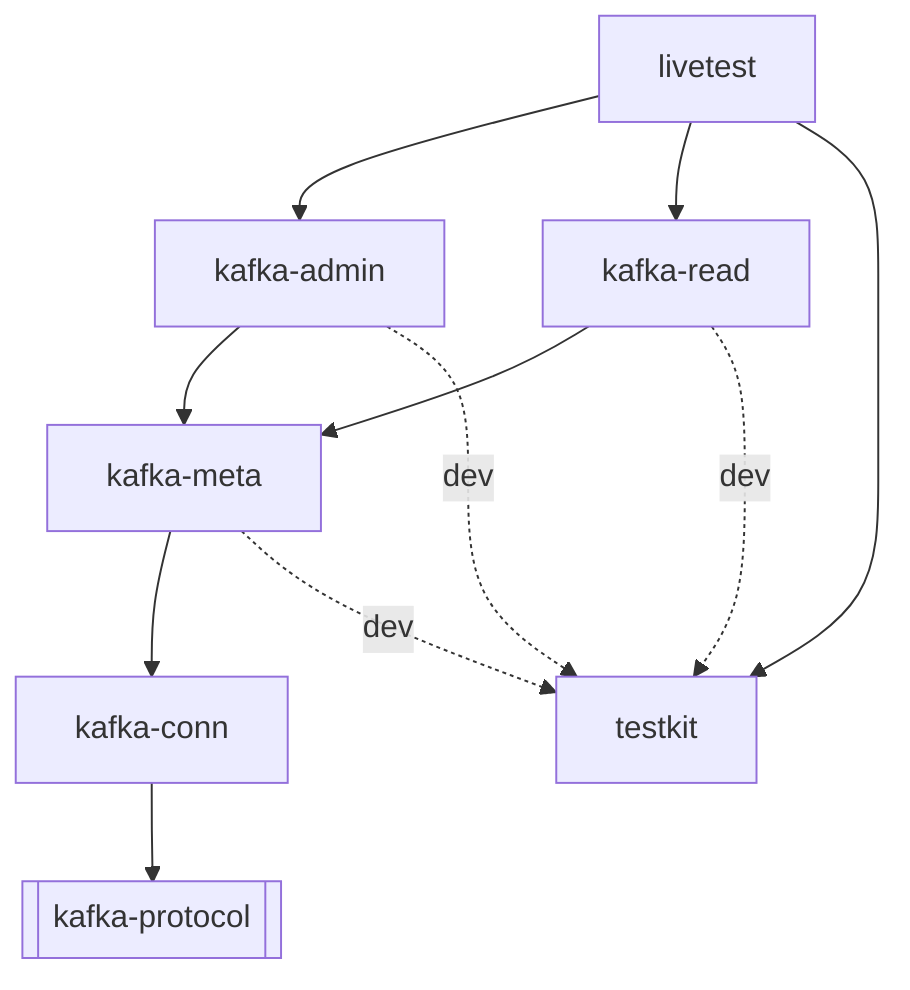

# Workspace layout

Seven crates in the workspace, plus one deliberately outside it.

| Crate | Lines | What it is |
|---|---|---|
| [`kafka-conn`](kafka-conn.md) | 5,609 | the wire: framing, correlation, versions, TLS, SASL |
| [`kafka-meta`](kafka-meta.md) | 1,662 | metadata cache, routing, pool, retry |
| [`kafka-admin`](kafka-admin.md) | 4,636 | 37 admin RPCs, per-item results |
| [`kafka-read`](kafka-read.md) | 2,560 | forward scan, backward tail, tolerant decode |
| [`testkit`](testkit.md) | 1,424 | container fixtures; `publish = false` |
| [`livetest`](livetest.md) | 1,787 | run against real clusters; `publish = false` |
| [`xtask`](xtask.md) | — | repo chores; `publish = false` |
| `interop` | — | rdkafka cross-check; **outside the workspace** |

## The dependency graph



Strictly layered, no cycles, no sideways edges. `kafka-admin` and
`kafka-read` do not know about each other; both reach the wire only through
`kafka-meta`.

## Why `interop` is outside the workspace

`rdkafka` builds librdkafka from C source and wants cmake and a C toolchain.
That is a fine thing to require of a job whose entire purpose is cross-client
interoperability, and a terrible thing to require of `cargo xtask ci` — CI on
a minimal runner image has already been red once over exactly this.

So the crate stands alone with its own `[workspace]` table and is built by
`cargo xtask interop`.

## Lints are inherited, not repeated

`[workspace.lints]` at the root carries [rule 2](../introduction.md):

```toml
[workspace.lints.clippy]
unwrap_used              = "deny"
expect_used              = "deny"
panic                    = "deny"
indexing_slicing         = "deny"
as_conversions           = "deny"
cast_possible_truncation = "deny"
cast_sign_loss           = "deny"

[workspace.lints.rust]
unsafe_code                   = "forbid"
missing_debug_implementations = "warn"
```

A new crate opts in with `[lints] workspace = true` in its manifest. That is
deliberately better than repeating `#![deny(...)]` attributes at each crate
root, because the failure mode of the attribute approach is a crate that
quietly forgets one.

Test code is exempted per crate with a `#![cfg_attr(test, allow(...))]` block
— tests may unwrap freely, and requiring them not to would make every
assertion three lines long.

Note `indexing_slicing` and the cast lints. Denying `a[i]` in library code is
unusual and it is the right call here: a panic from an out-of-bounds index on
a malformed response is exactly the failure rule 2 exists to prevent, and it
is the easiest one to write by accident.

## The codec dependency

```toml
kafka-protocol = { version = "0.17", default-features = false,
                   features = ["client", "messages_enums",
                               "gzip", "snappy", "lz4", "zstd"] }
```

Every part of that line is deliberate:

- **`default-features = false` + `client`** drops the broker half of the
  codegen — every response encoder and request decoder across 87 message
  types. We never act as a broker. See [Non-goals](../compat/non-goals.md).
- **`messages_enums` is not in `default`.** We need it: `RequestKind` and
  `ResponseKind` are what the read-only gate and the generic dispatch layer
  match on.
- **The four compression features are already in `default`.** Naming them
  matters only because defaults are off.

It is declared once in `[workspace.dependencies]` so an upstream bump is a
one-line change rather than a five-manifest change.

## Where to start reading

1. `crates/kafka-conn/src/conn.rs` — the connection actor, and the shape
   everything else assumes.
2. `crates/kafka-conn/src/versions.rs` — small, and it explains why the whole
   workspace is built around a codec that is a release behind.
3. `crates/kafka-meta/src/routing.rs` — 209 lines that encode knowledge
   otherwise scattered across every call site.
4. `crates/kafka-read/src/batch.rs` — the tolerant decoder, the most subtle
   file in the workspace.

## Rust and toolchain

Edition 2024, `rust-version = "1.97"`, pinned by `rust-toolchain.toml` to
1.97.1 with rustfmt, clippy, rust-src and rust-analyzer. `resolver = "3"`.
